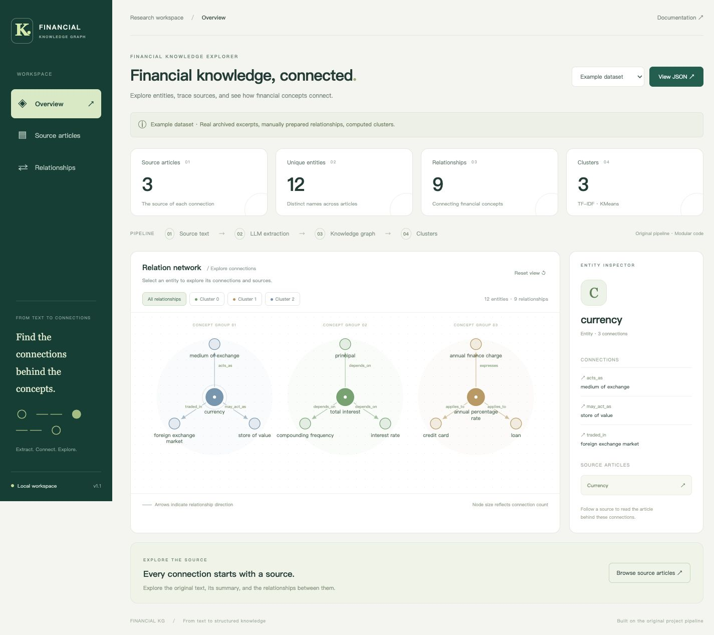
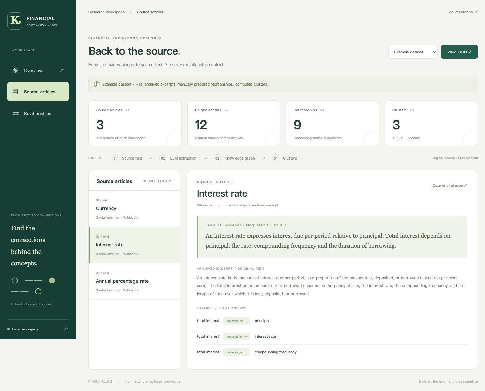
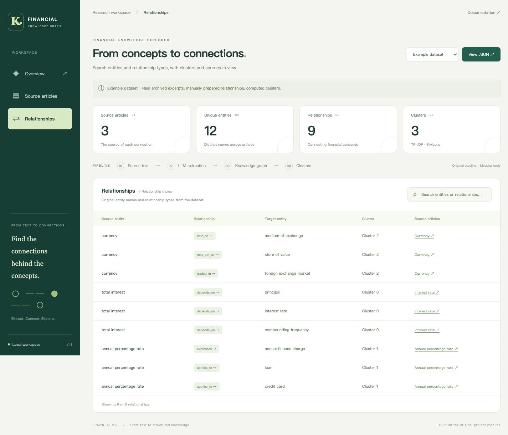

# Financial Knowledge Graph Builder with LLM

沿用原项目的处理方式：**Wikipedia / Investopedia 爬取 → LLM 摘要和关系提取 → Neo4j 入库 → TF-IDF + KMeans 聚类**。

这次以模块化重构为主。保留原三元组格式、图结构和聚类算法，没有引入新的提取方法、任务调度、审核门禁或服务框架。默认模型仍是 `gpt-3.5-turbo`；能否调用取决于你的服务与账户，可用 `--model` 指定支持 Chat Completions 及当前参数的模型。

## 前端展示与截图

展示界面使用原生 HTML、CSS、JavaScript 和 SVG，直接读取 Python 已有导出文件，无需安装 Node 或前端构建工具，也没有新增后台服务或登录系统。

在项目根目录启动：

```bash
python -m http.server 8000 --bind 127.0.0.1
```

浏览器打开 **http://127.0.0.1:8000/web/**。默认读取已附带的 `examples/expected/`，不需要 API 密钥或 Neo4j。请通过 HTTP 打开，不要直接双击 HTML 文件。

- **Overview（图谱概览）**：查看实体、关系、聚类数量；按聚类筛选，点击节点查看关联关系，再跳转对应文章。
- **Source articles（文章与摘要）**：切换来源文章，对照摘要、正文和关系三元组。
- **Relationships（关系明细）**：按实体名称或关系类型搜索，查看聚类和文章来源。
- **Local results（本地运行结果）**：选择右上角数据集，读取 `results/all_output.jsonl`、`results/relation_clusters.csv`；“View JSON”打开同目录的 `relations.json`。缺少聚类文件时仍可展示关系。

运行 Python 流程后，在页面切换到“Local results”即可。若自定义了输出目录，请将这三个输出文件放入 `results/`，或修改 `web/app.js` 中的数据目录。重新生成文件后切换数据集或刷新页面。页面不触发爬取、模型调用或数据库写入。图谱采用简单分组布局，适合浏览当前项目的小型数据集；表格保留全部关系。

页面文案统一为英文。下面均为实际浏览器截图。示例含 3 篇真实历史文本、12 个实体、9 条人工整理的演示关系、3 个实际计算的聚类；不是在线模型实测截图。

### 图谱概览



### 文章与摘要



### 关系明细



图片随仓库保存在 `docs/screenshots/`，以上使用 GitHub 支持的相对路径。提交 README 与图片目录后即可显示，无需图床。

## 结构

```text
financial_KG_builder_with_LLM_v1.py  # 保留原启动入口
financial_kg/
  cli.py            # 命令行参数、环境变量和资源关闭
  crawlers.py       # 原两个网站的爬取逻辑，统一返回 Content
  extraction.py     # 模型调用、摘要和关系文本解析
  graph.py          # 原 Entity / RELATION 模型及 Neo4j 操作
  clustering.py     # 原词频、TF-IDF、KMeans 流程
  pipeline.py       # 串联各阶段与文件输出
examples/
  articles.json     # 三条真实历史文章片段 + 人工整理的示例响应
  data_sources.csv  # 对应的三个在线来源
  expected/         # 已运行的离线示例输出
  README.md         # 示例来源、运行方式和验证边界
web/               # 前端页面、样式、交互和导出数据解析
docs/screenshots/  # README 使用的实际界面截图
tests/             # Python 回归测试及前端数据解析测试
data_Sources.csv    # 原始 30 条输入来源，未修改
all_output.txt      # 原仓库历史结果，未修改
```

两个爬虫都返回 `Entity` 和 `Content`；爬取入口补充 `Source` 和 `URL`。提取结果增加 `Summary`、`Relationships` 和 `RawAnswer`。仍使用普通字典，没有新增数据建模框架。旧历史文件中的 `Article` / `Soure` 不改写；新流程使用 `Content` / `Source`。

## 安装

Python 3.10+（本次在 Python 3.14 上验证）。在仓库目录执行：

```bash
python -m venv .venv
source .venv/bin/activate
python -m pip install -r requirements.txt
```

## 先运行三个离线示例

```bash
python financial_KG_builder_with_LLM_v1.py --example
```

该命令不需要密钥，不联网，不写 Neo4j。文章来自原仓库 `all_output.txt` 的真实历史片段；模型响应是人工按原格式整理的演示数据，**不是本次在线模型生成结果**。解析、文件导出和聚类实际执行，得到 3 篇文章、9 条关系。示例使用同一个 `run_pipeline`，只是用示例响应替代外部模型调用。

也可运行：

```bash
python -m financial_kg --example --clusters 3 --output-dir results/example
```

## 在线运行

通过环境变量配置，不再把密钥清空或写进代码。示例占位值请替换为你自己的配置；程序不自动读取 `.env`。

```bash
export OPENAI_API_KEY='你的密钥'
export NEO4J_PASSWORD='你的数据库密码'
export NEO4J_URI='bolt://localhost:8888'
export NEO4J_USER='financial'
python financial_KG_builder_with_LLM_v1.py
```

默认数据库地址、用户名沿用旧脚本；请按自己的 Neo4j 实例修改。使用兼容接口时可设置 `OPENAI_BASE_URL`，模型可用 `OPENAI_MODEL` 或 `--model` 配置。SDK 调用更新为 `client.chat.completions.create`，参见 [OpenAI 官方 API 文档](https://developers.openai.com/api/reference/python/resources/chat/subresources/completions/methods/create)。

只尝试三个真实来源、暂不写数据库：

```bash
python -m financial_kg --sources examples/data_sources.csv --skip-neo4j --clusters 3
```

其他参数：`--limit 3` 只处理前三条来源，`--delay 5` 设置爬取间隔，`--output-dir PATH` 指定输出目录。默认来源和输出位置相对于项目目录，不依赖启动时的工作目录。手动传入的相对路径则相对于当前工作目录。

## 输出

| 文件 | 内容 |
|---|---|
| `all_output.jsonl` | 每篇文章、来源、摘要、关系和原始响应 |
| `relations.json` | 汇总的 `[entity1, relation, entity2]` 三元组 |
| `cluster_keywords.csv` | 每个聚类的首个关键词 |
| `relation_clusters.csv` | 每条关系对应的聚类编号 |

默认写到 `results/`，同目录再次运行会覆盖这些文件。原仓库图片与 `all_output.txt` 是历史样例，不会由当前脚本更新。小样本会减少聚类数量；聚类编号仅是算法标签，不是经过人工标注的金融类别。

Neo4j 结构仍为：

```cypher
(a:Entity {name: ...})-[r:RELATION {type: ...}]->(b:Entity {name: ...})
```

## 修正范围

- 修复根目录输入路径、空 API 配置和未关闭客户端。
- 两类网页正文统一放在 `Content`，修复 Investopedia 回退返回字符串的问题。
- 摘要不再无条件删除首行；关系支持金融术语中的连字符。
- 非法关系发出警告并跳过，不再导致整批解析崩溃。
- 删除破坏 `profit` 等词语的全局 `of` 替换。
- 聚类关键词与关系分配分别导出，避免覆盖；固定随机种子便于复现。
- 去掉主流程中无用的 Notebook 表达式和重复处理分支。
- 恢复 HTTPS 证书验证，并让 HTTP 错误直接报错。

维持简单串行流程。没有新增自动恢复、缓存、并发、实体消歧或质量评分。网络、模型和数据库错误仍会直接抛出；已处理文章会留在 JSONL 中，但不实现断点续跑。网页结构变化、文章超过模型上下文、模型返回不符合格式的内容仍需实际排查。

## 测试

```bash
python -m unittest discover -s tests -v
```

测试覆盖解析错误、爬虫回退、Investopedia 单来源输入、小样本聚类、文件导出和数据库调用参数。外部服务在测试中使用替身，不表示已连通真实模型或数据库。

前端解析逻辑可用 Node 18+ 验证（仅开发测试需要，运行界面不需要）：

```bash
node --test tests/test_web.mjs
```
